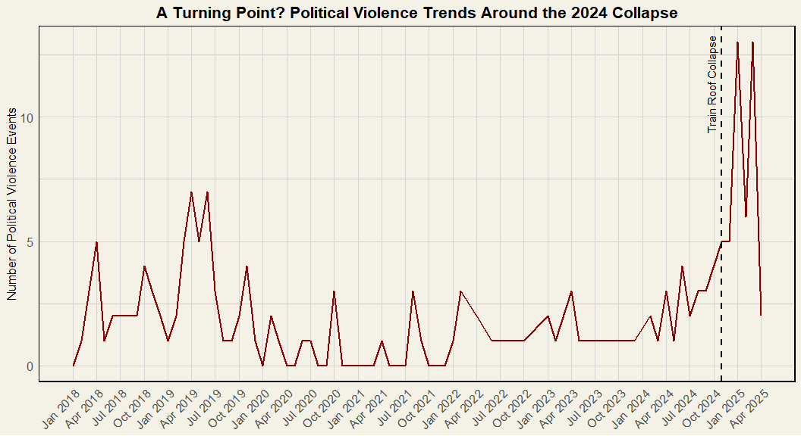
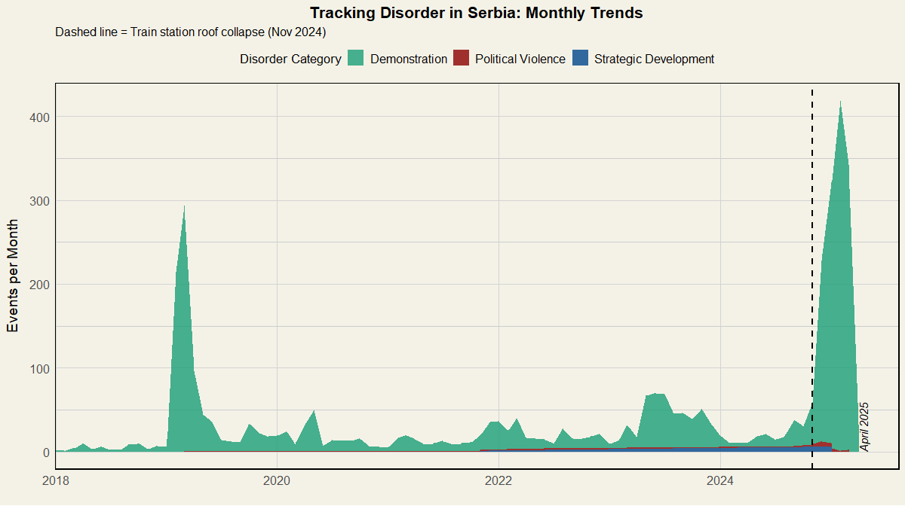
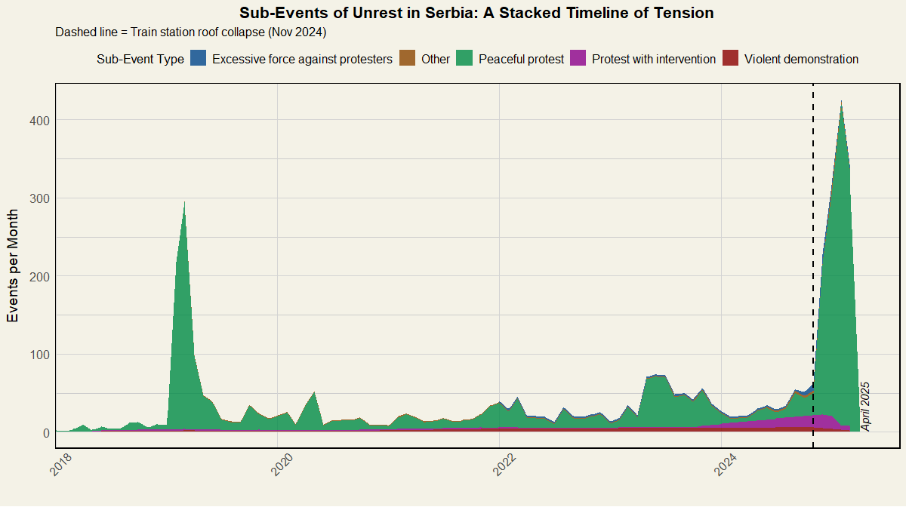
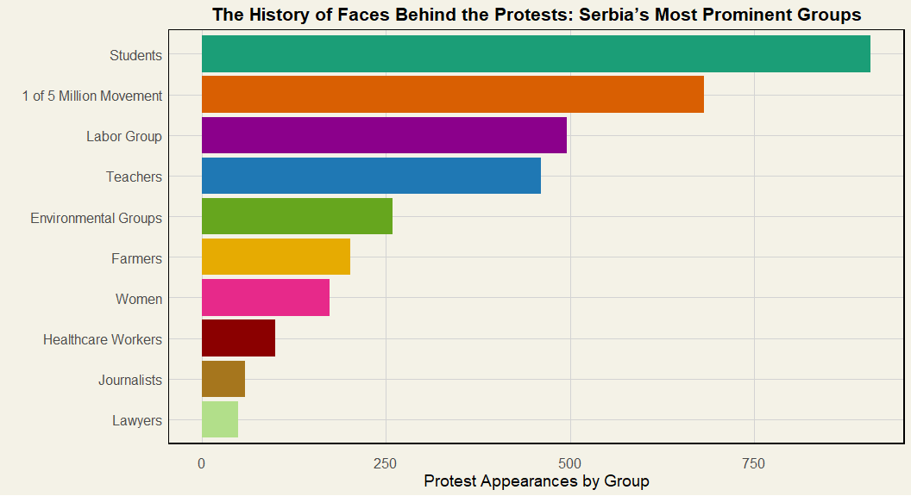
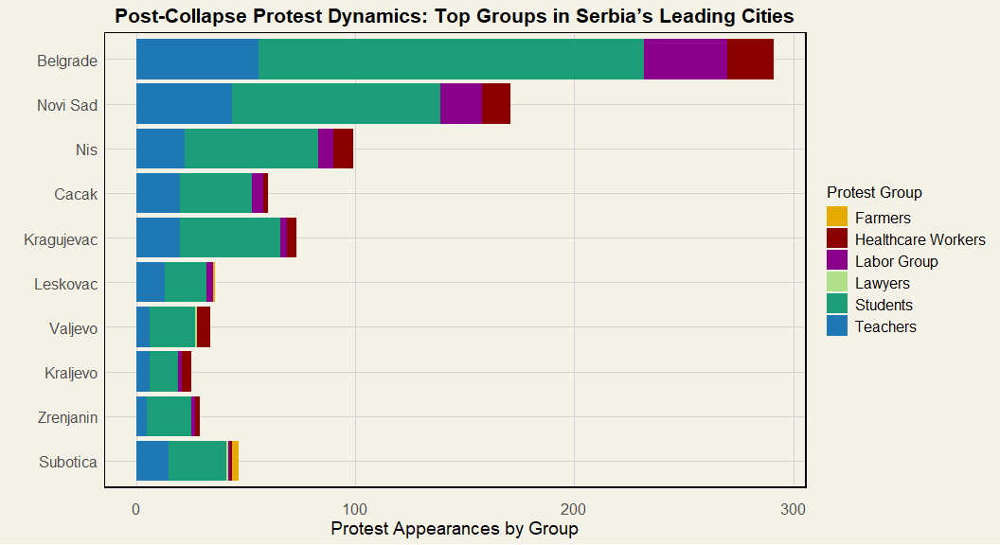
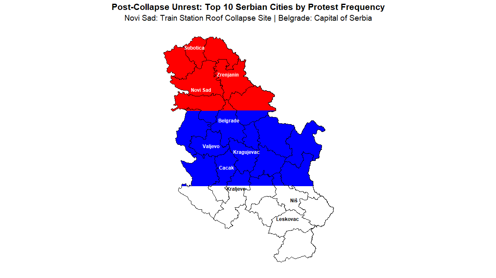
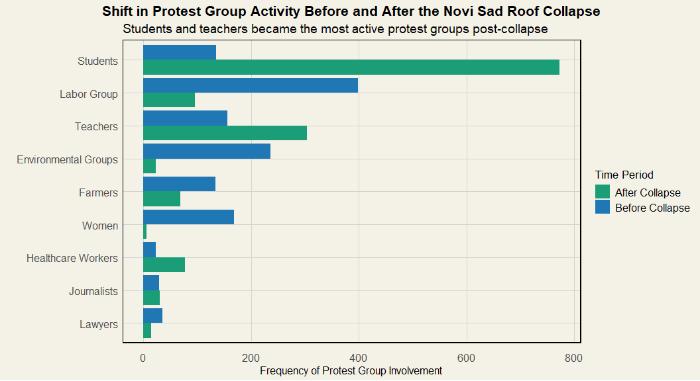

Protest Dynamics in Serbia Following the Train Station Roof Collapse
================

<style type="text/css">
  body{
  font-size: 14pt;
  }
</style>

## Setting the Stage

On November 11, 2024, the roof of a train station in Novi Sad, Serbia
collapsed, resulting in the deaths of 15 individuals. In the aftermath,
protests erupted, initially focused on demanding justice for the
victims. Over time, these protests grew in scale and scope, with student
groups and civil society organizations leading the call for broader
political reform. This project analyzes changes in protest activity in
Serbia following the collapse, examining patterns by protest group type,
geographic distribution, and the temporal evolution of events. The aim
is to provide a data-driven understanding of how the political crisis
has influenced civic engagement and activism in Serbia.

## Data Source

This data comes from ACLED which is an event-based data project designed
for disaggregated conflict analysis and crisis mapping. The data is
updated weekly. The two data sources I use contain information from
January 2018 up until the first week of April 2025. I used these values
to create visualizations that shed light on the civil response to the
train station roof collapse.

## Style Choices

My focus of this project was to highlight protest events and changing
protest group dynamic by location and time: before and after the train
station roof collapse. Given that I had many categorical variables to
use in my visualizations, I chose an overall color scheme of hues that
were less vibrant and on the duller side. I tried to choose colors that
provided enough contrast to see the differences between protest events
and protest groups. For variables that were portraying anything violent,
I used different saturations of red. In contrast, for variables that
were specifically peaceful, like “peaceful protest”, I chose different
saturations of green. All of my visualizations have an offset white hue
for the background and a black border around each plot. In my opinion,
this made viewing the visualizations easier and cleaner as compared to
the default white. For the map of Serbia, highlighting the top 10 cities
by protest frequency following the train station roof collapse, I chose
to fill the background as the Serbian flag.

## Load Necessary Libraries and Data Upload/ Manipulation

``` r
library(readr)
library(dplyr)
library(ggplot2)
library(dplyr)
library(sf)
library(rnaturalearth)
library(rnaturalearthdata)
library(lubridate)
library(tidyr)
library(stringr)
library(geodata)
library(patchwork)
library(forcats)
library(scales)

Europe_Central_Asia_2018_2025_Apr04 <- read_csv("C:/Users/katam/OneDrive/Documents/Data Viz/Final Project Serbia/Europe-Central-Asia_2018-2025_Apr04.csv")

#filtering to only contain Serbia as the country
serb <- Europe_Central_Asia_2018_2025_Apr04[grepl("serbia", 
                                                  Europe_Central_Asia_2018_2025_Apr04$country,
                                                  ignore.case = TRUE), ]
#making copy of serb to manipulate
serb1 <- serb

# Convert "4/4/2025" style dates into Date objects
serb1$event_date <- mdy(serb$event_date)


#filter the dataset and create train_roof_collapse variable
serb_clean <- serb1 %>%
  filter(!is.na(latitude), !is.na(longitude), !is.na(event_date)) %>%
  mutate(
    train_roof_collapse = ifelse(event_date >= as.Date("2024-11-01"),
                                 "after collapse", "before collapse")
  )


#create new variable to remove city name followed by neighborhood to only contain city name
# new variable called location_clean

serb_exploded <- serb_clean %>%
  mutate(location_clean = str_remove(location, " - .*"))  # Removes anything after ' - '

# creating clean protest_group variable
serb_exploded <- serb_exploded %>%
  separate_rows(assoc_actor_1, sep = ";") %>%
  mutate(assoc_actor_1 = str_trim(assoc_actor_1)) %>%
  mutate(
    protest_group = case_when(
      str_detect(assoc_actor_1, regex("Student", ignore_case = TRUE)) ~ "Students",
      str_detect(assoc_actor_1, regex("Teacher", ignore_case = TRUE)) ~ "Teachers",
      str_detect(assoc_actor_1, regex("Health|Medical", ignore_case = TRUE)) ~ "Healthcare Workers",
      str_detect(assoc_actor_1, regex("Labor|Worker", ignore_case = TRUE)) ~ "Labor Group",
      str_detect(assoc_actor_1, regex("Farmer", ignore_case = TRUE)) ~ "Farmers",
      str_detect(assoc_actor_1, regex("Journalist", ignore_case = TRUE)) ~ "Journalists",
      str_detect(assoc_actor_1, regex("Lawyer", ignore_case = TRUE)) ~ "Lawyers",
      str_detect(assoc_actor_1, regex("Women", ignore_case = TRUE)) ~ "Women",
      str_detect(assoc_actor_1, regex("Ecological|Environment|Green", ignore_case = TRUE)) ~ "Environmental Groups",
      str_detect(assoc_actor_1, regex("1 of 5 Million", ignore_case = TRUE)) ~ "1 of 5 Million Movement",
      TRUE ~ NA_character_
    )
  ) %>%
  filter(!is.na(protest_group))

#cleaning the disorder_type variable - now variable called disorder_category
serb_exploded <- serb_exploded %>%
  separate_rows(disorder_type, sep = ";") %>%
  mutate(disorder_type = str_trim(disorder_type)) %>%
  mutate(
    disorder_category = case_when(
      str_detect(disorder_type, regex("Demonstration", ignore_case = TRUE)) ~ "Demonstration",
      str_detect(disorder_type, regex("Political violence", ignore_case = TRUE)) ~ "Political Violence",
      str_detect(disorder_type, regex("Strategic development", ignore_case = TRUE)) ~ "Strategic Development",
      TRUE ~ NA_character_
    )
  ) %>%
  filter(!is.na(disorder_category))

#reading in second data set
number_of_political_violence_events_by_country_month_year_as_of_11Apr2025 <- 
  read_csv("C:/Users/katam/OneDrive/Documents/Data Viz/Final Project Serbia/number_of_political_violence_events_by_country-month-year_as-of-11Apr2025.csv")

#renaming the df and filtering to only contain Serbia
pol_viol_cmy <- 
  number_of_political_violence_events_by_country_month_year_as_of_11Apr2025[grepl("serbia",number_of_political_violence_events_by_country_month_year_as_of_11Apr2025$Country,
                                                                                               ignore.case = TRUE), ]

#converting months to numeric characters
pol_viol_cmy <- pol_viol_cmy %>%
  mutate(
    Month_num = match(Month, month.name),  # Converts "January" to 1, etc.
    Date = as.Date(paste(Year, Month_num, "01", sep = "-"))
  )

#Define the collapse date 
collapse_date <- as.Date("2024-11-01")
```

## Data Description

serb_exploded: a cleaned and processed data set that contains all
protest events, including location, protest groups and event dates

pol_viol_cmy: a cleaned and processed data set that contains
country-level monthly data on political violence events in Serbia

The geographic data I used to create maps was supplemented with spatial
shape files from the {geodata} package

## Political Violence in Serbia

In order to better understand the broader context of civil unrest in
Serbia, it is essential to examine trends in political violence over
time. This line graph analyzes the frequency of political violence
events in Serbia from February 2018 to April 2025, providing a
year-by-year and month-by-month breakdown. By identifying key spikes and
periods of stability, we can gain insight into the political climate and
shifts in public sentiment, particularly in relation to significant
events such as the train station roof collapse in November 2024. This
visualization will highlight how political violence has evolved and how
it may be linked to broader socio-political developments in the country.

``` r
collapse_date <- as.Date("2024-11-01")  


ggplot(pol_viol_cmy, aes(x = Date, y = Events)) +
  geom_line(color = "darkred", size = 1) +
  geom_vline(xintercept = collapse_date, linetype = "dashed", color = "black", size = 1) +
  annotate("text", x = collapse_date, y = max(pol_viol_cmy$Events, na.rm = TRUE) * 0.87,
           label = "Train Roof Collapse", angle = 90, vjust = -0.7, color = "black", size = 4) +
  scale_x_date(breaks = seq(from = min(pol_viol_cmy$Date), to = as.Date("2025-04-01"), by = "3 months"),
               date_labels = "%b %Y",
               limits = c(min(pol_viol_cmy$Date), as.Date("2025-04-01"))) +
  labs(
    title = "A Turning Point? Political Violence Trends Around the 2024 Collapse",
    x = NULL, 
    y = "Number of Political Violence Events"
  ) +
  theme_minimal() +
  theme(
    plot.background = element_rect(fill = "#f4f2e7", color = NA), 
    panel.background = element_rect(fill = "#f4f2e7", color = NA),
    panel.border = element_rect(color = "black", fill = NA, size = 1), 
    panel.grid.major.x = element_line(color = "lightgray", size = 0.5),
    panel.grid.minor.x = element_blank(),
    panel.grid.major.y = element_line(color = "lightgray", size = 0.5),  
    panel.grid.minor.y = element_line(color = "gray80", size = 0.25),    
    axis.text.x = element_text(angle = 45, hjust = 1, size = 12),  
    axis.text.y = element_text(size = 12), 
    axis.title.y = element_text(size = 12),
    plot.title = element_text(size = 16, face = "bold", hjust = 0.5)
  )
```

<!-- -->

The line plot visualizes the frequency of political violence events in
Serbia over time, with a distinct dashed line marking the date of the
train station roof collapse in November 2024. Prior to this event,
political violence incidents remained relatively steady, fluctuating
modestly over the years. However, immediately following the collapse,
there is a marked increase in the number of political violence events,
signaling a potential shift in the political climate and public
response. This spike suggests that the collapse may have acted as a
catalyst for heightened unrest or more aggressive forms of dissent,
possibly due to growing public dissatisfaction or perceived government
negligence.

While the rise in political violence events provides a focused view of
intensifying unrest, it is equally important to understand how different
types of disorder evolved during this period. To offer a broader
perspective, the following area chart disaggregates all disorder events
by category and tracks their occurrence over time. This visualization
allows for a more nuanced analysis of whether specific types of
disorder—such as demonstrations, strategic developments, or political
violence—have shifted in volume or prominence in the months surrounding
the collapse

``` r
monthly_disorder <- serb_exploded %>%
  filter(!is.na(disorder_category)) %>%
  mutate(
    month = floor_date(event_date, "month"),
    train_roof_collapse = ifelse(event_date >= as.Date("2024-11-01"),
                                 "after collapse", "before collapse")
  ) %>%
  group_by(month, disorder_category) %>%
  summarise(events = n(), .groups = "drop")

# Normalize events per month 

last_date <- as.Date("2025-04-01")  

ggplot(monthly_disorder, aes(x = month, y = events, fill = disorder_category)) +
  geom_area(alpha = 0.8, position = "stack") +
  geom_vline(xintercept = as.Date("2024-11-01"), linetype = "dashed", color = "black", size =1) +
  annotate(
    "text", x = last_date, y = 0, label = "April 2025", angle = 90,
    hjust = 0, vjust = 1, size = 4, fontface = "italic"
  ) +
  scale_x_date(
    expand = expansion(mult = c(0, 0.05))
  ) +
  scale_fill_manual(values = c(
    "Demonstration" = "#1b9e77",
    "Political Violence" = "darkred",
    "Strategic Development" = "#00468b"
  )) +
  labs(
    title = "Tracking Disorder in Serbia: Monthly Trends",
    subtitle = "Dashed line = Train station roof collapse (Nov 2024)",
    x = "", y = "Events per Month", fill = "Disorder Category"
  ) +
  theme_minimal() +
  theme(
    plot.background = element_rect(fill = "#f4f2e7", color = NA),   
    panel.background = element_rect(fill = "#f4f2e7", color = NA),
    panel.border = element_rect(color = "black", fill = NA, size = 1),
    panel.grid.major.x = element_line(color = "lightgray", size = 0.5),
    panel.grid.minor.x = element_blank(),
    panel.grid.major.y = element_line(color = "lightgray", size = 0.5),   
    panel.grid.minor.y = element_line(color = "gray80", size = 0.25),    
    plot.subtitle = element_text(size = 12), 
    axis.title.y = element_text(size = 14, margin = margin(r = 10)),
    axis.text.x = element_text(size = 12),
    axis.text.y = element_text(size = 12),
    plot.title = element_text(hjust = 0.5, size = 16, face = "bold"),
    legend.text = element_text(size = 12),
    legend.title = element_text(size = 13),
    legend.position = "top"
  )
```

<!-- -->

The chart makes clear that demonstrations have consistently been the
dominant form of unrest in Serbia throughout the observed period.
Notably, there is a significant spike in demonstrations in 2019, largely
driven by the 1 of 5 Million movement, a widespread protest campaign
against government corruption and media suppression. A similar surge
appears again following the roof collapse, reinforcing the trend that
public dissent in Serbia has often manifested through mass, largely
peaceful, demonstrations rather than violent conflict. This context
provides an essential foundation for understanding the nature of
subsequent disorder events and the groups involved.

To further unpack the nature of the rise in demonstrations following the
train roof collapse, the next area chart disaggregates events by
sub-event type, providing insight into how these demonstrations
manifested on the ground. While Serbian leadership, including their
current president Aleksandar Vučić, characterized the protests as
violent, the data tells a different story. This visualization reveals
that the vast majority of post-collapse protest activity was comprised
of peaceful demonstrations, rather than violent or interventionist
actions. By highlighting the composition of disorder events over time,
this chart challenges political narratives and emphasizes the largely
nonviolent nature of civic mobilization in the aftermath of the
collapse.

``` r
monthly_sub_event <- serb_exploded %>%
  filter(!is.na(sub_event_type)) %>%
  mutate(
    #  Clean sub_event_type by grouping rare ones
    sub_event_type_grouped = case_when(
      sub_event_type %in% c("Attack", "Mob violence") ~ "Other",
      TRUE ~ sub_event_type
    ),
    
    #  Date transformation
    month = floor_date(event_date, "month"),
    
    #  Flag for collapse timing
    train_roof_collapse = ifelse(event_date >= as.Date("2024-11-01"),
                                 "after collapse", "before collapse")
  ) %>%
  group_by(month, sub_event_type_grouped) %>%
  summarise(events = n(), .groups = "drop")


last_date <- as.Date("2025-04-01")

ggplot(monthly_sub_event, aes(x = month, y = events, fill = sub_event_type_grouped)) +
  geom_area(alpha = 0.8, position = "stack") +
  geom_vline(xintercept = as.Date("2024-11-01"), linetype = "dashed", color = "black", size = 1) +
  annotate("text",
           x = last_date,
           y = 0,
           label = "April 2025",
           angle = 90,
           hjust = 0,
           vjust = 1,
           size = 4,
           fontface = "italic") +
  scale_x_date(
    breaks = seq(from = as.Date("2018-01-01"), to = last_date, by = "2 year"),
    labels = scales::date_format("%Y"),
    expand = expansion(mult = c(0, 0.05))
  ) +
  scale_fill_manual(values = c(
    "Excessive force against protesters" = "#00468b",
    "Other" = "#8b4600",
    "Peaceful protest" = "#008b46",
    "Protest with intervention" = "#8b008b",
    "Violent demonstration" = "darkred"
  )) +
  labs(
    title = "Sub-Events of Unrest in Serbia: A Stacked Timeline of Tension",
    subtitle = "Dashed line = Train station roof collapse (Nov 2024)",
    x = "", y = "Events per Month", fill = "Sub-Event Type"
  ) +
  theme_minimal() +
  theme(
    plot.background = element_rect(fill = "#f4f2e7", color = NA),   
    panel.background = element_rect(fill = "#f4f2e7", color = NA),
    panel.border = element_rect(color = "black", fill = NA, size = 1),
    panel.grid.major.x = element_line(color = "lightgray", size = 0.5),
    panel.grid.minor.x = element_blank(),
    panel.grid.major.y = element_line(color = "lightgray", size = 0.5),   
    panel.grid.minor.y = element_line(color = "gray80", size = 0.25),     
    plot.subtitle = element_text(size = 12), 
    axis.title.y = element_text(size = 14, margin = margin(r = 10)),
    axis.text.x = element_text(angle = 45, hjust = 0.5, vjust = 1, size = 12, margin = margin(t = 8)),
    axis.text.y = element_text(size = 12),
    plot.title = element_text(hjust = 0.5, size = 16, face = "bold"),
    legend.position = "top",
    legend.text = element_text(size = 12),
    legend.title = element_text(size = 13),
  )
```

<!-- -->

While the area chart clearly demonstrates that the majority of the
sub-event types in the post-roof collapse period were peaceful protests,
it is crucial to understand who was participating in these
demonstrations and how different groups engaged in the protests. To
explore this further, the next bar graph examines protest group
demographics across all events in the data set, not just those occurring
after the train station roof collapse. This chart provides a broader
perspective on the composition of protest groups throughout the entire
period, offering insights into the diversity and scale of participation
across various social and professional sectors in Serbia. By comparing
this data to the previous analysis, we can better understand the
dynamics of protest participation and the shifts in involvement across
different groups over time.

``` r
protest_colors <- c(
  "Students" = "#1b9e77",
  "1 of 5 Million Movement" = "#d95f02",
  "Labor Group" = "#8b008b",
  "Teachers" = "#1f78b4",
  "Environmental Groups" = "#66a61e",
  "Farmers" = "#e6ab02",
  "Women" = "#e7298a",
  "Healthcare Workers" = "#8b0000",
  "Journalists" = "#a6761d",
  "Lawyers" = "#b2df8a"
)

serb_exploded %>%
  filter(!is.na(protest_group)) %>%
  count(protest_group, sort = TRUE) %>%
  slice_max(n = 10, order_by = n) %>%
  ggplot(aes(x = fct_reorder(protest_group, n), y = n, fill = protest_group)) +
  geom_col(show.legend = FALSE) +
  coord_flip() +
  scale_fill_manual(values = protest_colors) +
  labs(title = "The History of Faces Behind the Protests: Serbia’s Most Prominent Groups",
       x = "",
       y = "Protest Appearances by Group") +
  theme_minimal() +
  theme (
    plot.background = element_rect(fill = "#f4f2e7", color = NA),   
    panel.background = element_rect(fill = "#f4f2e7", color = NA),
    panel.border = element_rect(color = "black", fill = NA, size = 1),
    panel.grid.major.x = element_line(color = "lightgray", size = 0.5),
    panel.grid.minor.x = element_blank(),
    panel.grid.major.y = element_line(color = "lightgray", size = 0.5),   
    panel.grid.minor.y = element_line(color = "gray80", size = 0.25),    
    axis.title.x = element_text(size = 14),
    axis.text.x = element_text(size = 12, margin = margin(t = 8)),
    axis.text.y = element_text(size = 12),
    plot.title = element_text(hjust = 0.5, size = 16, face = "bold"),
    
  )
```

<!-- -->

The bar chart displaying the top 10 protest groups in Serbia by number
of events highlights the central role of student-led activism in the
country’s recent protest landscape. Students emerge as the most active
group, followed closely by the 1 of 5 Million movement, labor groups,
and teachers. The 1 of 5 Million movement, which gained momentum in late
2018 and peaked in 2019, was a broad-based citizen initiative sparked by
public outrage over political violence and deteriorating democratic
institutions. The anti-government movement began after an assault on
opposition politician Borko Stefanović in November 2018 and was fueled
by widespread concerns over political violence, media censorship,
corruption, and the authoritarian tendencies of President Aleksandar
Vučić’s government. The movement’s name originated from Vučić’s
dismissive remark that he would not yield to even five million
protesters, prompting the slogan “One in Five Million” to symbolize the
collective power of the people.

While this chart offers a broad view of protest group activity across
Serbia over several years, it doesn’t reflect how these dynamics may
have shifted in response to a major national event — the train station
roof collapse in November 2024 that resulted in the loss of 15 innocent
lives. To better understand how the protest landscape evolved, we now
narrow our focus to events that occurred after the collapse.

The following visualization highlights the most active protest groups in
the top 10 cities that experienced the highest number of protest events
following the incident. By examining protest group activity in these key
urban centers, we can observe whether new groups emerged, existing ones
intensified their efforts, or if certain types of protests became more
geographically concentrated in the aftermath of the collapse.

``` r
serb_exploded <- serb_exploded %>%
  filter(!is.na(latitude), !is.na(longitude), !is.na(event_date)) %>%
  mutate(after_collapse = event_date >= as.Date("2024-11-01"))

top_10_cities <- serb_exploded %>%
  filter(after_collapse == TRUE, !is.na(protest_group)) %>%
  count(location_clean, sort = TRUE) %>%
  slice_max(n = 10, order_by = n) %>%
  pull(location_clean)

protest_color <- c(
  "Students" = "#1b9e77",
  "Labor Group" = "#8b008b",
  "Teachers" = "#1f78b4",
  "Farmers" = "#e6ab02",
  "Healthcare Workers" = "#8b0000",
  "Lawyers" = "#b2df8a"
)


# Filter and plot
serb_exploded %>%
  filter(after_collapse == TRUE, !is.na(protest_group), location_clean %in% top_10_cities) %>%
  count(location_clean, protest_group, sort = TRUE) %>%
  group_by(location_clean) %>%
  slice_max(n = 4, order_by = n) %>%  
  ggplot(aes(x = fct_reorder(location_clean, n), y = n, fill = protest_group)) +
  geom_col(position = "stack") +
  coord_flip() +
  scale_fill_manual(values = protest_color) +
  labs(title = "Post-Collapse Protest Dynamics: Top Groups in Serbia’s Leading Cities",
       x = "", y = "Protest Appearances by Group", fill = "Protest Group") +
  theme_minimal() +
  theme(
    plot.background = element_rect(fill = "#f4f2e7", color = NA),   
    panel.background = element_rect(fill = "#f4f2e7", color = NA),
    panel.border = element_rect(color = "black", fill = NA, size = 1),
    panel.grid.major.x = element_line(color = "lightgray", size = 0.5),
    panel.grid.minor.x = element_blank(),
    panel.grid.major.y = element_line(color = "lightgray", size = 0.5),   
    panel.grid.minor.y = element_line(color = "gray80", size = 0.25),     
    axis.title.x = element_text(size = 14),
    axis.text.x = element_text(size = 12, margin = margin(t = 8)),
    axis.text.y = element_text(size = 12),
    plot.title = element_text(hjust = 0.5, size = 16, face = "bold"),
    legend.text = element_text(size = 12),
    legend.title = element_text(size = 13),
  )
```

<!-- -->

This visualization presents the distribution of protest group
involvement across the ten Serbian cities with the highest number of
protest events after the Novi Sad train station roof collapse. The chart
reveals distinct patterns of mobilization, with student and teacher
groups emerging as prominent actors in several urban centers. The
variation in group presence across cities suggests that while the roof
collapse served as a unifying catalyst, localized social and
institutional dynamics influenced the nature and intensity of protest
activity. Protest dynamics varied across locations — with students,
teachers, and labor groups being especially active in cities like
Belgrade, Novi Sad, and Nis. This suggests that while the collapse acted
as a national trigger, local context shaped who mobilized and how
strongly in different areas.

While the previous chart highlights the most active protest groups in
the cities most affected after the train roof collapse, the following
map provides a geographic view of where these protest events were most
concentrated across Serbia. By visualizing the top 10 cities on the map,
we can better understand the spatial dimension of post-collapse protest
activity. Notably, Belgrade—the capital—recorded the highest number of
protest events, followed by Novi Sad, where the roof collapse occurred.
The distribution of these cities also shows that protests were not
confined to one region but were spread throughout the country.

``` r
# Download Serbia administrative boundaries (level 1) using terra
serbia_spat <- geodata::gadm("SRB", level = 1, path = tempdir())

# Convert to sf object for plotting
serbia_sf <- sf::st_as_sf(serbia_spat)

# Assign a CRS 
if (is.null(st_crs(serbia_sf))) {
  st_crs(serbia_sf) <- 4326  # WGS 84
}

serb_exploded_top_10 <- serb_exploded %>%
  filter(!is.na(latitude), !is.na(longitude), !is.na(event_date)) %>%
  mutate(after_collapse = event_date >= as.Date("2024-11-01"))

top_10_cities <- serb_exploded_top_10 %>%
  filter(after_collapse == TRUE, !is.na(protest_group)) %>%
  count(location_clean, sort = TRUE) %>%
  slice_max(n = 10, order_by = n) %>%
  pull(location_clean)

cities <- tibble::tibble(
  name = c("Belgrade", "Novi Sad", "Niš", "Kragujevac", "Subotica",
           "Cacak", "Zrenjanin", "Kraljevo", "Valjevo", "Leskovac"),
  lon = c(20.46, 19.84, 21.90, 20.92, 19.66,
          20.35, 20.39, 20.69, 19.88, 21.95),
  lat = c(44.82, 45.26, 43.32, 44.02, 46.10,
          43.89, 45.38, 43.72, 44.27, 42.99),
  color = c("white", "white", "black", "white","white",
            "white", "white", "black", "white", "black"),
)

# Add a new column for shape_type to categorize Belgrade and Novi Sad
cities <- cities %>%
  mutate(
    shape_type = case_when(
      name == "Belgrade" ~ "Capital",
      name == "Novi Sad" ~ " Train Roof Collapse",
      TRUE ~ "Regular"
    )
  )

# Get Serbia's bounding box
bbox <- st_bbox(serbia_sf)

# Calculate Y-ranges for 3 equal horizontal bands
y_top <- bbox["ymax"]
y_1third <- bbox["ymax"] - (1/3) * (bbox["ymax"] - bbox["ymin"])
y_2third <- bbox["ymax"] - (2/3) * (bbox["ymax"] - bbox["ymin"])
y_bottom <- bbox["ymin"]

# Create three rectangular bands as sf polygons
red_band <- st_as_sf(st_sfc(st_polygon(list(rbind(
  c(bbox["xmin"], y_top),
  c(bbox["xmax"], y_top),
  c(bbox["xmax"], y_1third),
  c(bbox["xmin"], y_1third),
  c(bbox["xmin"], y_top)
))), crs = st_crs(serbia_sf)))

blue_band <- st_as_sf(st_sfc(st_polygon(list(rbind(
  c(bbox["xmin"], y_1third),
  c(bbox["xmax"], y_1third),
  c(bbox["xmax"], y_2third),
  c(bbox["xmin"], y_2third),
  c(bbox["xmin"], y_1third)
))), crs = st_crs(serbia_sf)))

white_band <- st_as_sf(st_sfc(st_polygon(list(rbind(
  c(bbox["xmin"], y_2third),
  c(bbox["xmax"], y_2third),
  c(bbox["xmax"], y_bottom),
  c(bbox["xmin"], y_bottom),
  c(bbox["xmin"], y_2third)
))), crs = st_crs(serbia_sf)))

#clip each band to serbias shape
red_band_clipped <- st_intersection(serbia_sf, red_band)
blue_band_clipped <- st_intersection(serbia_sf, blue_band)
white_band_clipped <- st_intersection(serbia_sf, white_band)

# Plot
ggplot() +
  geom_sf(data = white_band_clipped, fill = "white", color = NA) +
  geom_sf(data = blue_band_clipped, fill = "blue", color = NA) +
  geom_sf(data = red_band_clipped, fill = "red", color = NA) +
  geom_sf(data = serbia_sf, fill = NA, color = "black", size = 0.5) +
  geom_text(
    data = cities %>%
      mutate(
        lon = ifelse(name == "Belgrade", lon - 0.05, lon),
        lat = ifelse(name == "Belgrade", lat - 0.1, lat),
        
        lon = ifelse(name == "Novi Sad", lon - 0.1, lon),
        lat = ifelse(name == "Novi Sad", lat + 0.0, lat),
        
        lon = ifelse(name == "Niš", lon + 0.1, lon),
        lat = ifelse(name == "Niš", lat + 0, lat),
        
        lon = ifelse(name == "Kragujevac", lon - 0.08, lon),
        lat = ifelse(name == "Kragujevac", lat + 0.15, lat),
        
        lon = ifelse(name == "Subotica", lon - 0.1, lon),
        lat = ifelse(name == "Subotica", lat - 0.1, lat),
        
        lon = ifelse(name == "Cacak", lon + 0, lon),
        lat = ifelse(name == "Cacak", lat + 0, lat),
        
        lon = ifelse(name == "Zrenjanin", lon - 0.0, lon),
        lat = ifelse(name == "Zrenjanin", lat + 0.15, lat),
        
        lon = ifelse(name == "Kraljevo", lon - 0.1, lon),
        lat = ifelse(name == "Kraljevo", lat - 0.2, lat),
        
        lon = ifelse(name == "Valjevo", lon + 0.1, lon),
        lat = ifelse(name == "Valjevo", lat + 0, lat),
        
        lon = ifelse(name == "Leskovac", lon - 0.1, lon),
        lat = ifelse(name == "Leskovac", lat + 0.0, lat)
      ),
    aes(x = lon, y = lat, label = name, color = color),
    size = 3.1, fontface = "bold", hjust = 0.5, vjust = 0.5, show.legend = FALSE
  ) +
  scale_color_identity() + 
  labs(title = "Post-Collapse Unrest: Top 10 Serbian Cities by Protest Frequency",
subtitle = "Novi Sad: Train Station Roof Collapse Site | Belgrade: Capital of Serbia") +
  theme_minimal() +
  theme(
    axis.title = element_blank(),
    axis.text = element_blank(),
    axis.ticks = element_blank(),
    panel.grid = element_blank(),
    plot.title = element_text(hjust = 0.5, face = "bold", size = 16),
    plot.subtitle = element_text(hjust = 0.5, size = 14),
    plot.caption = element_text(hjust = 0.5, size = 10)
  )
```

<!-- -->

While the geographic map reveals the spatial distribution of protest
activity following the train roof collapse—highlighting Belgrade as the
epicenter and Novi Sad as the site of the incident—it is equally
important to examine how patterns of participation evolved over time.
The following visualization shifts from a geographic lens to a temporal
one, comparing protest group involvement before and after the collapse.
This temporal comparison offers insight into which groups intensified
their mobilization in the aftermath of the crisis, shedding light on
broader shifts in civic engagement and collective action across Serbia.

``` r
serb_exploded %>%
  group_by(after_collapse, protest_group) %>%
  summarise(count = n(), .groups = "drop") %>%
  mutate(period = ifelse(after_collapse, "After Collapse", "Before Collapse")) %>%
  filter(protest_group != "1 of 5 Million Movement") %>%  # Exclude this specific group
  ggplot(aes(x = reorder(protest_group, count), y = count, fill = period)) +
  geom_col(position = "dodge") +
  coord_flip() +
  labs(
    title = "Shift in Protest Group Activity Before and After the Novi Sad Roof Collapse",
    subtitle = "Students and teachers became the most active protest groups post-collapse",
    x = "",
    y = "Frequency of Protest Group Involvement",
    fill = "Time Period"
  ) +
  scale_fill_manual(
    values = c("Before Collapse" = "#1f78b4", "After Collapse" = "#1b9e77")
  ) +
  theme_minimal() +
  theme( plot.background = element_rect(fill = "#f4f2e7", color = NA),   
panel.background = element_rect(fill = "#f4f2e7", color = NA),
panel.border = element_rect(color = "black", fill = NA, size = 1),
panel.grid.major.x = element_line(color = "lightgray", size = 0.5),
panel.grid.minor.x = element_blank(),
panel.grid.major.y = element_line(color = "lightgray", size = 0.5),   
panel.grid.minor.y = element_line(color = "gray80", size = 0.25),   
axis.title.x = element_text(size = 12),
axis.text.x = element_text(size = 12, margin = margin(t = 8)),
axis.text.y = element_text(size = 12),
plot.title = element_text(hjust = 0.5, size = 16, face = "bold"),
plot.subtitle = element_text(size = 14),
legend.text = element_text(size = 12),
legend.title = element_text(size = 13)
)
```

<!-- -->

The comparison of protest group activity before and after the train
station roof collapse reveals significant shifts in patterns of
mobilization across Serbia. Notably, students and teachers emerged as
the most active groups following the incident, with a marked increase in
protest events compared to the period prior. This surge suggests that
the collapse acted as a catalyst for heightened engagement, particularly
among younger populations and educational professionals. The increased
visibility of infrastructural neglect may have galvanized students to
organize, while teachers likely joined in solidarity and to express
broader concerns about the safety and conditions of public institutions.
Healthcare workers also demonstrated a rise in mobilization after the
collapse, potentially driven by heightened awareness of public safety
failures and the strain such emergencies place on the medical system.
These shifts indicate that the roof collapse was not merely an isolated
event, but one that triggered deeper societal concerns and prompted
targeted collective action among key civil sectors.

## Key Insights and Implications

This project provided a comprehensive analysis of protest activity in
Serbia from 2018 through early 2025, revealing important patterns in
civic mobilization, protest group dynamics, and geographic
concentrations of unrest. The data demonstrated that while various forms
of disorder were present throughout the period,
demonstrations—particularly peaceful protests—were by far the most
common. A major turning point occurred in November 2024, following the
tragic collapse of a train station roof in Novi Sad. In the aftermath,
there was a sharp rise in protest events, especially among students,
teachers, and healthcare workers, reflecting deep public dissatisfaction
with government accountability and infrastructure neglect.
Geographically, protest activity was not limited to urban centers, but
spread across the country, with Belgrade and Novi Sad leading in event
counts. The emergence and sustained presence of movements such as the “1
of 5 Million” further underscores the population’s ongoing struggle for
transparency, reform, and democratic rights. Ultimately, this analysis
highlights that protest in Serbia is not episodic but persistent—driven
by an engaged citizenry that continues to demand accountability from
those in power.

## Citations

<https://acleddata.com/data/#download>  
<https://www.gmfus.org/news/protests-leave-serbias-politics-finely-balanced>
<https://abcnews.go.com/International/wireStory/tensions-mount-ahead-pro-government-rally-serbia-counter-120741785>
<https://apnews.com/article/serbia-train-station-roof-collapse-arrests-75ce32518db2b255229655bce39cb4f8>
<https://apnews.com/article/serbia-students-strasbourg-eu-protest-398094de8251ffb3579231e805fc28a7?utm_source=copy&utm_medium=share>
<https://apnews.com/article/serbia-protest-students-roof-collapse-prosecutor-vucic-b2aa7a208e53006dab4e086588b7355d>
